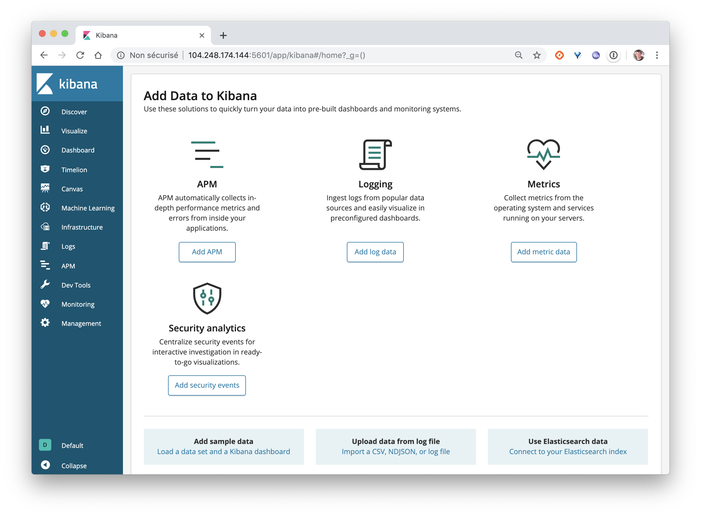
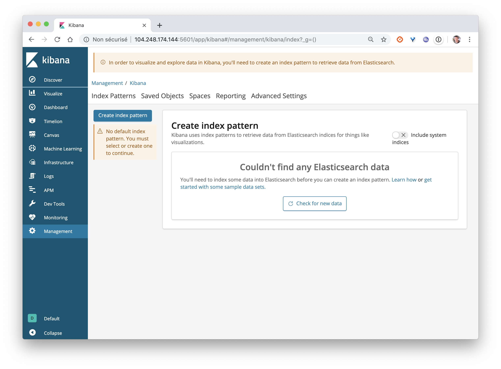
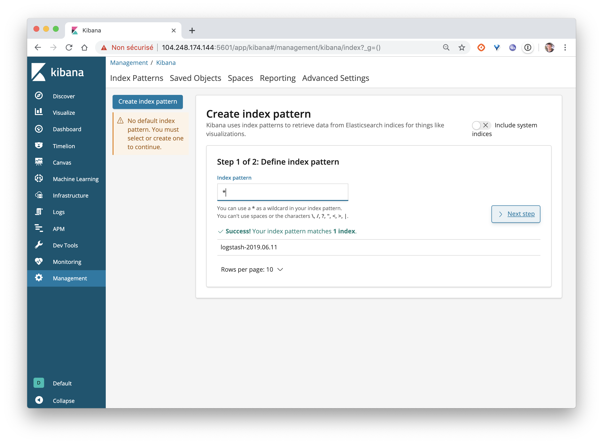
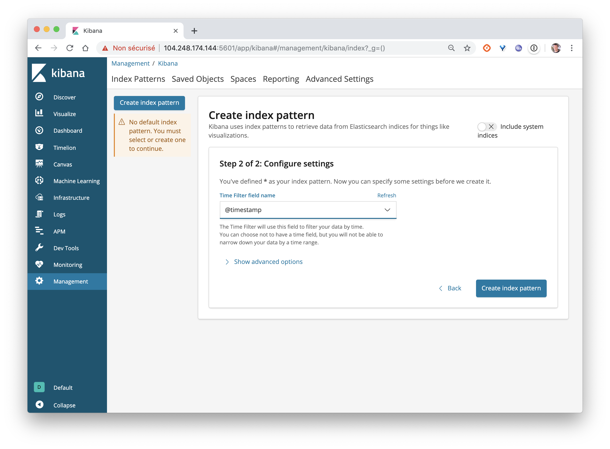
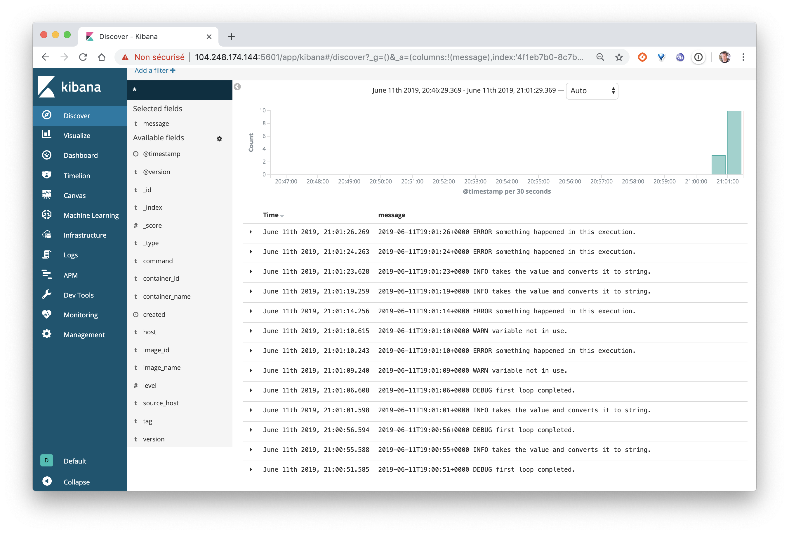

Dans cet exercice, vous allez déployer une stack Elastic et configurer le daemon docker afin que tous les logs des containers soient envoyés dans cette stack.

## Pré-requis

Pour faire cet exercice, vous aurez besoin:
- d'un hôte Docker en mode Swarm, que nous appelerons *node1*,  sur lequel aura été lancé la commande suivante afin de modifier le paramètre mémoire du noyau Linux ```sudo sysctl -w vm.max_map_count=262144```
- d'un hôte Docker extérieur au Swarm, que nous appelerons *node2*

## Déploiement de la stack Elastic (sur node1)

Copiez le contenu suivant dans le *logstash.conf*, Fichier de configuration de Logstash:

```
input {
 gelf {}
}

output {
 elasticsearch {
   hosts => ["elasticsearch:9200"]
 }
 stdout { codec => rubydebug }
}
```

Copiez le contenu suivant dans *elastic.yml*

```
version: '3.7'

configs:
  logstash-conf:
    file: ./logstash.conf

services:
  logstash:
    image: logstash:6.5.4
    configs:
    - source: logstash-conf
      target: /config/logstash.conf
    ports:
      - 12201:12201/udp
    command: ["logstash", "-f", "/config/logstash.conf"]
  elasticsearch:
    image: elasticsearch:6.5.4
  kibana:
    image: kibana:6.5.4
    ports:
      - 5601:5601
```

Déployez la stack Elastic avec la commande suivante:

```
$ docker stack deploy -c elastic.yml logs
Creating network logs_default
Creating config logs_logstash-conf
Creating service logs_elasticsearch
Creating service logs_kibana
Creating service logs_logstash
```

Vérifiez que les services sont correctement démarrés:

```
$ docker service ls
ID            NAME                 MODE         REPLICAS    IMAGE                 PORTS
gfkcuqbhd8wn  logs_elasticsearch   replicated   1/1         elasticsearch:6.5.4
ou9rc6lb1q6x  logs_kibana          replicated   1/1         kibana:6.5.4          *:5601->5601/tcp
vwpjkxhehsbc  logs_logstash        replicated   1/1         logstash:6.5.4        *:12201->12201/udp
```

Vous devriez pouvoir accéder à l'interface de Kibana depuis l'IP d'une des machines de votre Swarm sur le port 5601.



Si vous sélectionnez le menu *Discover*, vous ne verrez pas de données car nous n'avons pas envoyé de logs pour le moment.



## Configuration du daemon Docker (sur node2)

Créez, ou modifiez si il existe déjà, le fichier */etc/docker/daemon.json*, de façon à ajouter les propriétés relatives au driver de log:

Note: prenez soin de remplacer HOST par l'adresse IP de l'une des machines de votre Swarm

```
{
  "log-driver": "gelf",
  "log-opts": {
    "gelf-address": "udp://HOST:12201"
  }
}
```

Redémarrez ensuite le daemon Docker avec la commande suivante:

```
$ sudo systemctl restart docker
```

## Test

Afin de vérifier que tout est bien configuré, lancez la commande suivante afin de générer des logs de façon aléatoire:

```
$ docker run -d chentex/random-logger:latest
```

Vérifiez ensuite, sur l'interface web de *Kibana* que les logs ont bien été reçus.

Vous commencerez par la création d'un index





Puis, depuis le menu *Discover* vous pourrez visualiser les logs reçus


